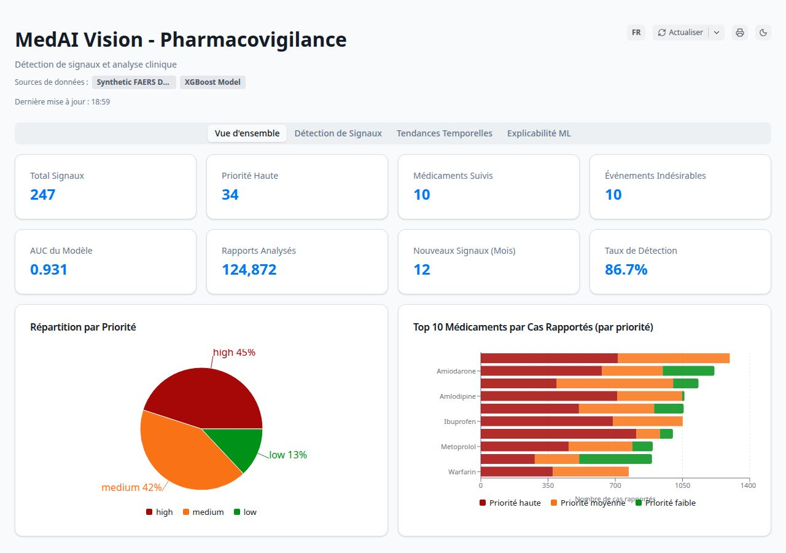

# MedAI Vision

Pharmacovigilance signal detection dashboard built with Plotly.js and React.

MedAI Vision is an interactive dashboard for analyzing adverse drug reaction (ADR) signals using standard pharmacovigilance disproportionality methods (PRR, ROR, IC, EBGM) and a machine learning classifier (XGBoost).



## Features

- **Signal detection** using PRR, ROR, IC, EBGM with 95% confidence intervals
- **Volcano plot** of drug–ADR associations with significance thresholds
- **Heatmap** of drug × reaction relationships
- **Temporal trend analysis** of ADR reporting across quarters
- **Model-based risk prediction** (XGBoost classifier)
- **Explainability**: feature importance, ROC curve, confusion matrix
- **Bilingual interface**: French and Arabic (RTL support), dark mode

## Demo

🔗 https://huggingface.co/spaces/samibahig-md/medai-vision

## Tech Stack

- [Plotly.js](https://plotly.com/javascript/) — interactive scientific charts
- [React 18](https://react.dev/) + [Vite](https://vitejs.dev/)
- [TypeScript](https://www.typescriptlang.org/)
- [Tailwind CSS](https://tailwindcss.com/) + [shadcn/ui](https://ui.shadcn.com/)
- [TanStack Query](https://tanstack.com/query) for data fetching
- [Express](https://expressjs.com/) backend (synthetic data)

## Quick start

```bash
# Install dependencies (requires pnpm)
npm install -g pnpm
pnpm install

# Start the dashboard (port 3000) and API server (port 5000)
pnpm --filter @workspace/medai-dashboard run dev
pnpm --filter @workspace/api-server run dev
```

Then open http://localhost:3000

### Single-command production server

```bash
pnpm install
pnpm --filter @workspace/medai-dashboard run build
node server.js
```

Visit http://localhost:7860 — the standalone `server.js` serves both the API and the built frontend.

## Data format

The dashboard expects pharmacovigilance reports with the following fields. A small sample dataset is provided in `data/sample_adr.csv` (200 anonymized synthetic rows).

| Column | Type | Example |
|---|---|---|
| `drug_name` | string | Atorvastatin |
| `reaction` | string | Hepatotoxicity |
| `date` | ISO date | 2023-06-14 |
| `age` | int | 67 |
| `sex` | M / F | F |
| `country` | ISO 3166 | FR |
| `outcome` | enum | recovered / hospitalized / fatal |

## Repository structure

```
medai-vision/
├── artifacts/
│   ├── medai-dashboard/   # React + Vite frontend (Plotly.js charts)
│   └── api-server/        # Express API (synthetic data endpoints)
├── lib/                   # Shared TypeScript libs (OpenAPI types)
├── data/
│   └── sample_adr.csv     # Anonymized sample dataset
├── public/
│   └── screenshots/       # Dashboard previews
├── server.js              # Standalone single-process server (for Docker)
├── Dockerfile             # HuggingFace Spaces / generic Docker deploy
└── README.md
```

## License

MIT — see [LICENSE](LICENSE).

## Disclaimer

This tool is for **research and educational purposes only**. It is not validated for clinical decision-making, regulatory submission, or patient care. All data shown in the demo is synthetic.
